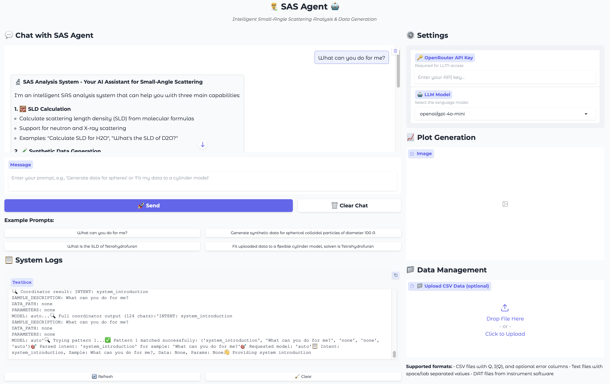

# SasAgent - AI-Powered Small-Angle Scattering Analysis System



SasAgent is an intelligent multi-agent system designed to automate and enhance Small Angle Scattering (SAS) data analysis. Built with CrewAI and powered by SasView, it provides an intuitive web interface for data fitting, synthetic data generation, and scattering length density (SLD) calculations.

## 🚀 Features

### 🤖 Multi-Agent AI System
- **Coordinator Agent**: Orchestrates analysis workflows and task delegation
- **RAG Model Selector**: Intelligent model selection using retrieval-augmented generation
- **SasView Fitter**: Automated parameter fitting with Bumps optimization
- **Synthetic Data Generator**: Creates realistic test datasets with known parameters

### 📊 Core Capabilities
- **Automated Model Fitting**: Fit SAS data to physical models with AI-guided parameter optimization
- **Synthetic Data Generation**: Generate realistic scattering data for testing and validation
- **SLD Calculation**: Calculate scattering length densities for neutron and X-ray scattering
- **Interactive Web Interface**: User-friendly Gradio-based frontend for all operations
- **RAG-Enhanced Model Selection**: Smart model recommendations based on data characteristics

### 🔧 Supported Analysis Types
- Spherical particles (hard spheres, fuzzy spheres, core-shell)
- Polymer systems (flexible cylinders, chains)
- Colloids and nanoparticles
- All 78 available SasView models
- Custom model parameters and constraints

## 📋 Requirements

### System Dependencies
- Python 3.8+
- SasView/SasModels
- Bumps fitting engine

### Python Packages
```bash
# Core scientific computing
numpy
scipy
pandas
matplotlib

# SAS modeling and fitting
sasmodels

# AI agent framework
crewai

# Web interface
gradio
pillow
```

## 🛠️ Installation

1. **Clone the repository**
   ```bash
   git clone https://github.com/ljding94/SasAgent.git
   cd SasAgent
   ```

2. **Install dependencies**
   ```bash
   pip install -r requirements.txt
   ```

3. **Set up environment variables** (Optional)
   ```bash
   # Disable telemetry for privacy
   export OTEL_SDK_DISABLED=true
   export CREWAI_TELEMETRY_DISABLED=true
   export DO_NOT_TRACK=1
   ```

4. **Configure LLM backend**
   - Set up your preferred LLM API (OpenAI, OpenRouter, etc.)
   - Configure API keys in environment variables

## 🚀 Quick Start

### Launch the Web Interface
```bash
python app.py
```

The application will start a Gradio web interface accessible at `http://localhost:7860`

### Basic Usage

1. **Data Fitting**
   - Upload your SAS data file (CSV format with q, I columns)
   - Specify the model type or let the AI suggest one
   - Set parameter constraints if needed
   - Click "Fit Data" to start the analysis

2. **Synthetic Data Generation**
   - Choose a model type (sphere, cylinder, etc.)
   - Set model parameters
   - Generate synthetic data with optional noise
   - Use for testing and validation

3. **SLD Calculation**
   - Enter molecular formula (e.g., "H2O", "C6H6")
   - Specify density and measurement conditions
   - Calculate neutron or X-ray scattering length density

## 📁 Project Structure

```
SasAgent/
├── .gitignore                      # Git ignore configuration
├── README.md                       # Project README (this file)
├── requirements.txt                # Python dependencies (requirements.txt also supported)
├── app.py                          # Main Gradio web interface
├── crewai_sas_agents.py            # Multi-agent system implementation
├── *.py                            # Other Python modules and scripts
├── SAS/                            # Core SAS analysis modules
│   ├── __init__.py                 # Package initialization
│   ├── fitting.py                  # Model fitting with Bumps
│   ├── generation.py               # Synthetic data generation
│   ├── sld_calculator.py           # SLD calculations
│   └── *.py                        # Additional SAS analysis modules
├── RAG/                            # Retrieval-Augmented Generation system
│   ├── README.md                   # RAG system documentation
│   ├── sasview_rag_system.py       # RAG implementation
│   ├── sasview_data_pipeline.py    # Data processing pipeline
│   └── *.py                        # Additional RAG modules
└── test/                           # Unit tests and examples (tracked)
    ├── README.md                   # Test documentation
    └── *.py                        # Test files and examples
```

## 🧪 Usage Examples

The following examples demonstrate how to use SasAgent's **AI-powered multi-agent system** through natural language prompts. The system automatically coordinates between different specialist agents to complete complex SAS analysis tasks.

### Example 1: AI-Guided Data Fitting
```python
from crewai_sas_agents import analyze_sas_data

# Let AI analyze and fit experimental data with intelligent model selection
result = analyze_sas_data(
    prompt="Analyze my experimental data and fit it to the best model for spherical gold nanoparticles in D2O",
    data_path="experimental_data.csv"
)

# AI system will:
# 1. Coordinator agent routes the task to fitting specialist
# 2. RAG agent suggests appropriate models based on sample description
# 3. SasView fitter performs automated parameter optimization
# 4. Return comprehensive results with plots and parameter uncertainties

print(f"Best fit model: {result['model']}")
print(f"Fitted parameters: {result['parameters']}")
print(f"Chi-squared: {result['chi_squared']}")
```

### Example 2: AI-Powered Synthetic Data Generation
```python
from crewai_sas_agents import analyze_sas_data

# Generate realistic synthetic data using AI-guided parameter selection
result = analyze_sas_data(
    prompt="Generate synthetic scattering data for flexible polymer chains in THF solvent with 5% noise",
    output_folder="./generated_data"
)

# AI system will:
# 1. Coordinator identifies this as a generation task
# 2. RAG agent selects appropriate polymer model (flexible_cylinder)
# 3. AI calculates realistic SLD values for THF solvent
# 4. Generator creates synthetic data with specified noise level
# 5. Saves data and plots to specified folder

print(f"Generated file: {result['data_file']}")
print(f"Ground truth parameters: {result['true_parameters']}")
```

### Example 3: Intelligent SLD Calculation
```python
from crewai_sas_agents import analyze_sas_data

# AI-powered SLD calculation with chemical formula understanding
result = analyze_sas_data(
    prompt="Calculate the neutron scattering length density for polystyrene (C8H8)n with density 1.05 g/cm³"
)

# AI system will:
# 1. Coordinator recognizes SLD calculation request
# 2. Parses chemical formula and physical parameters
# 3. Calculates SLD using SasView's algorithms
# 4. Provides detailed results with units and context

print(f"Neutron SLD: {result['sld_real']:.2e} Å⁻²")
print(f"X-ray SLD: {result['sld_xray']:.2e} Å⁻²")
```

### Example 4: Conversational Analysis with Memory
```python
from crewai_sas_agents import UnifiedSASAnalysisSystem

# Initialize system for conversational analysis
sas_system = UnifiedSASAnalysisSystem()
chat_history = []

# First interaction - generate data
result1 = sas_system.analyze_data(
    prompt="Generate synthetic data for core-shell spheres with silica core and polymer shell",
    chat_history=chat_history
)
chat_history.append([
    "Generate synthetic data for core-shell spheres with silica core and polymer shell",
    f"Generated synthetic data: {result1['summary']}"
])

# Second interaction - the AI remembers previous context
result2 = sas_system.analyze_data(
    prompt="Now fit this generated data to see if we can recover the original parameters",
    data_path=result1['data_file'],
    chat_history=chat_history
)

# AI system maintains context and understands "this generated data" refers to result1
print(f"Parameter recovery accuracy: {result2['parameter_accuracy']}")
```

### Example 5: Advanced Model Selection with Constraints
```python
from crewai_sas_agents import analyze_sas_data

# Complex analysis with user-specified constraints
result = analyze_sas_data(
    prompt="""Fit my colloid data to a hard sphere model.
    The particle radius should be between 20-100 Å,
    and the sample SLD is approximately 1.5e-6 Å⁻².
    The solvent is D2O.""",
    data_path="colloid_experiment.csv"
)

# AI system will:
# 1. Parse natural language constraints
# 2. Set appropriate parameter bounds (radius: 20-100 Å)
# 3. Use known D2O SLD value (6.4e-6 Å⁻²)
# 4. Apply user-specified sample SLD constraint
# 5. Perform constrained optimization with uncertainty analysis

print(f"Optimized radius: {result['radius']} ± {result['radius_uncertainty']} Å")
```

## 🔬 Scientific Background

SasAgent leverages the power of AI to automate complex SAS analysis workflows. The system:

- Uses physics-informed model selection through RAG
- Employs Bayesian optimization for parameter fitting
- Incorporates domain knowledge from SasView's extensive model library
- Provides uncertainty quantification for fitted parameters

## Link

- [SasView Project](https://www.sasview.org/) for the core SAS modeling framework
- [CrewAI](https://crewai.com/) for the multi-agent system architecture
- [Bumps](https://bumps.readthedocs.io/) for the optimization engine
- [Gradio](https://gradio.app/) for the web interface framework


**SasAgent** - Making Small Angle Scattering analysis intelligent and accessible 🔬✨